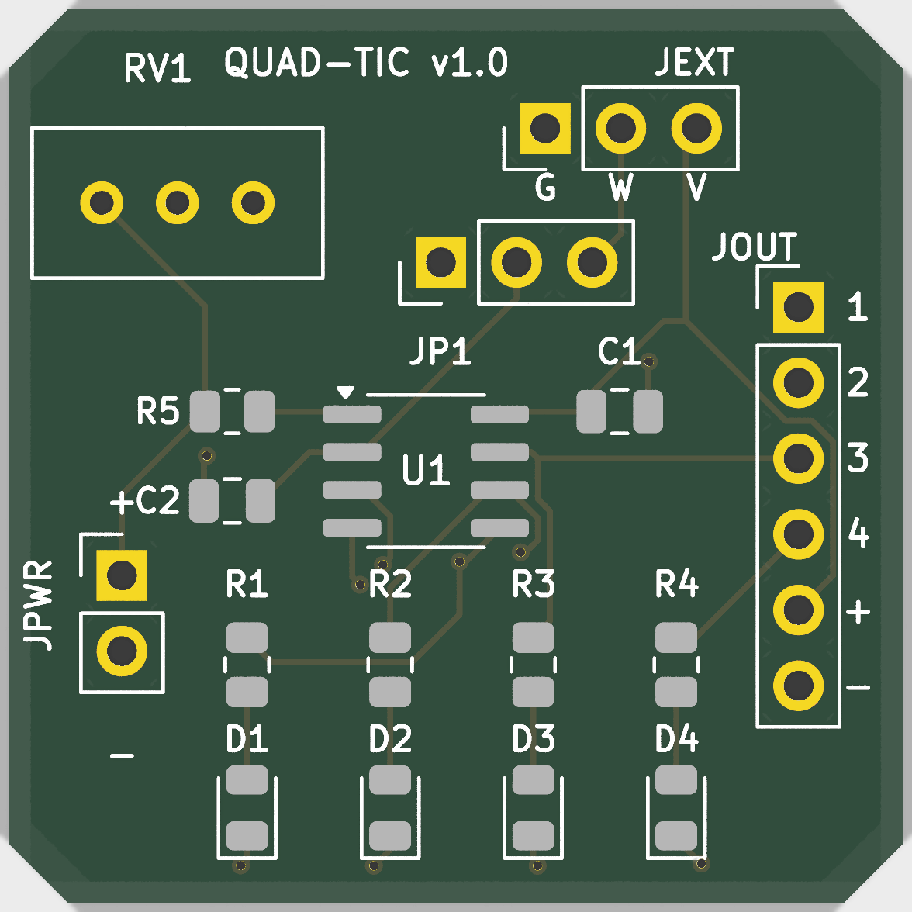
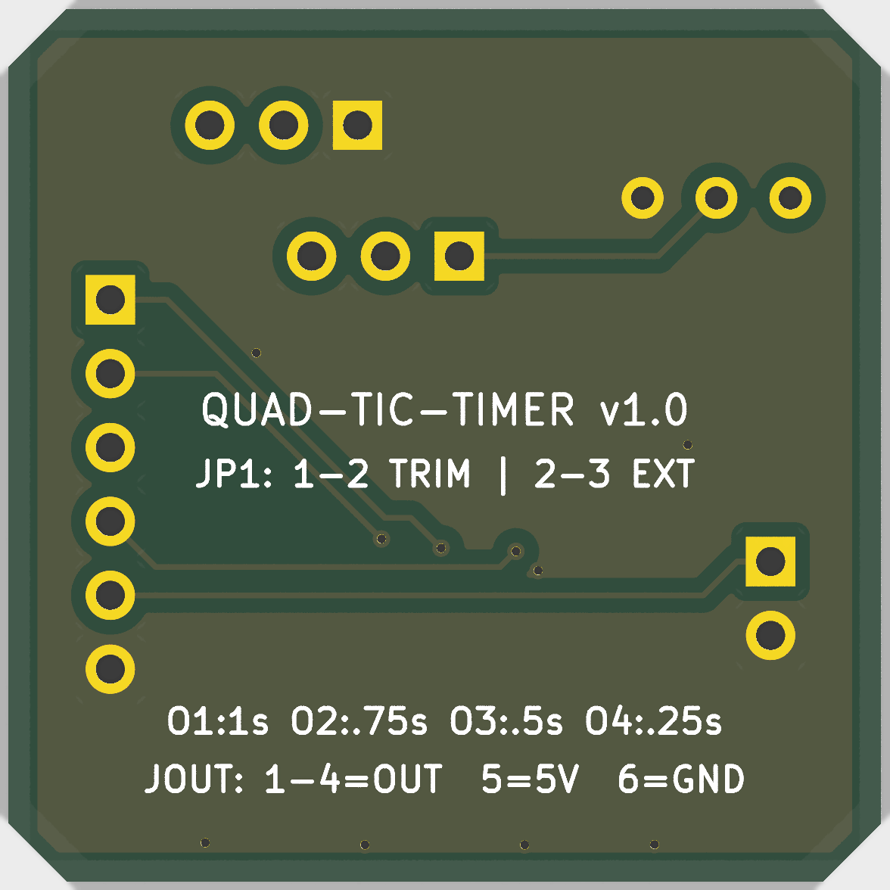

# quad-tic-timer

A single ATtiny85 that puts out four synchronized tick channels from one knob. No 555s, no extra oscillators. You turn the pot and all four outputs speed up or slow down together, keeping their ratios exact.

It was built for a small robotics project that needed several timing references at once without adding boards or trimming four separate RC circuits.

<p align="center">
  
  
</p>

## What it does

Four active-HIGH pulse outputs, 10 ms wide:

| Output | Pin | Nominal (pot centered) | Full CCW | Full CW |
|--------|-----|------------------------|----------|---------|
| o1 | PB0 | 1.00 s/tic | 0.20 s | 5.00 s |
| o2 | PB1 | 0.75 s/tic | 0.15 s | 3.75 s |
| o3 | PB2 | 0.50 s/tic | 0.10 s | 2.50 s |
| o4 | PB4 | 0.25 s/tic | 0.05 s | 1.25 s |

The pot sets one global scale factor `k` from 0.2 to 5.0. Center detent is 1.0x. The mapping is exponential, `k = 5^((adc-512)/512)`, so the slow end stays usable instead of bunching up the way a linear map would.

Timing is phase-accurate: each channel schedules its next edge as `next += period`, so error never accumulates. Ratios stay exact even while you turn the knob. Absolute accuracy follows the ATtiny85 internal oscillator, roughly 1% after factory calibration. That is an order of magnitude better than a 555 RC stage and fine for sequencing work.

## Wiring

```
ATtiny85 (SOIC-8/DIP-8, 8 MHz internal)
VCC -- 100nF -- GND (as close to the chip as possible)
PB3 -- pot wiper (10k 10-turn lin, ends to VCC/GND) + 10nF to GND
PB0 -- o1
PB1 -- o2
PB2 -- o3
PB4 -- o4
RST -- 10k to VCC (leave free for ISP)
```

Outputs drive LEDs through 330R or logic inputs directly. Total draw is a few mA plus loads.

Pot: 10k linear 10-turn precision type. Panel version is Bourns 3590S-1-103L with an H-22 turns-counting dial (5 turns from center to either end). If board space is tight, use the 25-turn trimmer Bourns 3296W-103 instead — same wiring, smaller, adjusted with a screwdriver. Either way center (5 turns from either stop) is the nominal 1.0x rate.

BOM: 1x ATtiny85, 1x 10k 10-turn pot, 1x 100nF, 1x 10nF, 1x 10k resistor. Nothing else.

## Build and flash

ATTinyCore, ATtiny85, 8 MHz internal, LTO enabled.

```bash
arduino-cli compile --fqbn ATTinyCore:avr:attinyx5:chip=85,clock=8internal quad-tic-timer.ino
avrdude -c usbasp -p t85 -U flash:w:quad-tic-timer.ino.hex:i -U lfuse:w:0xe2:m -U hfuse:w:0xdf:m -U efuse:w:0xff:m
```

Or open `quad-tic-timer.ino` in the Arduino IDE (sketchbook is at `microcontrollers/00_toolchain/arduino-ide`) and flash with USBasp / Arduino-as-ISP. Keep the reset pin enabled.

Check it with four LEDs first. Center the pot, o1 should blink once per second, o4 four times per second. Turn fully left and o1 runs at 5 Hz. Turn fully right and o1 takes 5 s per blink.

## Tuning

Two constants matter in `quad-tic-timer.ino`:

- `TIC_US` (10 ms) — shorten to 2–5 ms if the receiving logic is edge-sensitive and fast, lengthen to 20–50 ms for relays or optocouplers.
- The `> 2` deadband and 50 ms pot poll — tuned for a 10-turn pot (about 100 ADC steps per turn). Raise the deadband to 6–8 in a noisy supply, lower the poll to 20 ms if you want a snappier knob.

Pot reads are averaged over 16 samples and referenced to VCC, so the reading is ratiometric and supply drift largely cancels out. One ADC step is about 0.3% rate change at mid-scale, roughly a third of a turn feel on a 10-turn pot.

## Where it fits

- Robot gait and sequencer clocks: one channel steps the main loop, the faster channels drive leg phases, sensor polls, or status blinks from the same tempo.
- Sensor scheduler: poll slow sensors on o1/o2, fast IMU or encoder sampling on o3/o4, all slowing together in low-power mode.
- Servo/stepper test bench: sweep the whole timing tree with one hand while watching mechanics respond.
- Automation and stage props: trigger solenoids, pumps, or lights at related intervals without a full PLC.
- Camera trap / timelapse: o1 fires the shutter, o4 wakes the focus/metering chain just before.
- Music and kinetic art: clock dividers for drum triggers, solenoids, or LED chases.

Any place that currently uses two to four 555s for related rates is a candidate. This replaces them with one 8-pin chip and holds ratio over temperature far better than RC timing.

## Limits

- Not a reference clock. The internal oscillator drifts about 1–2% with voltage and temperature. Ratios are exact, absolute rate is not.
- Shortest period is 50 ms on o4 at full CCW. The 10 ms pulse is then 20% duty, which is fine for logic but too wide for some edge counters. Adjust `TIC_US` if that matters.
- ADC noise on a long wiper wire can make the tempo wander at the extremes. Keep the wiper lead short and keep the 10nF cap.

If you later need crystal accuracy, port the sketch unchanged to an ATmega328P Nano clone or STM32 Blue Pill and set the same four pins. For lab-grade absolute rate, feed a DS3231 1 Hz TCXO into a spare input and discipline `k` against it.

## Files

```
quad-tic-timer/
  quad-tic-timer.ino  firmware, ATtiny85, single sketch, no dependencies
  README.md           this file
  .gitignore          Arduino/AVR/PlatformIO ignores
  pcb/                production 30x30mm KiCad 9 PCB & JLCPCB manufacturing package
    quad-tic-timer.kicad_pcb
    quad-tic-timer.kicad_sch
    quad-tic-timer-drc.rpt
    quad-tic-timer-erc.rpt
    jlcpcb_production/  Gerbers, BOM, CPL, 3D renders
```
